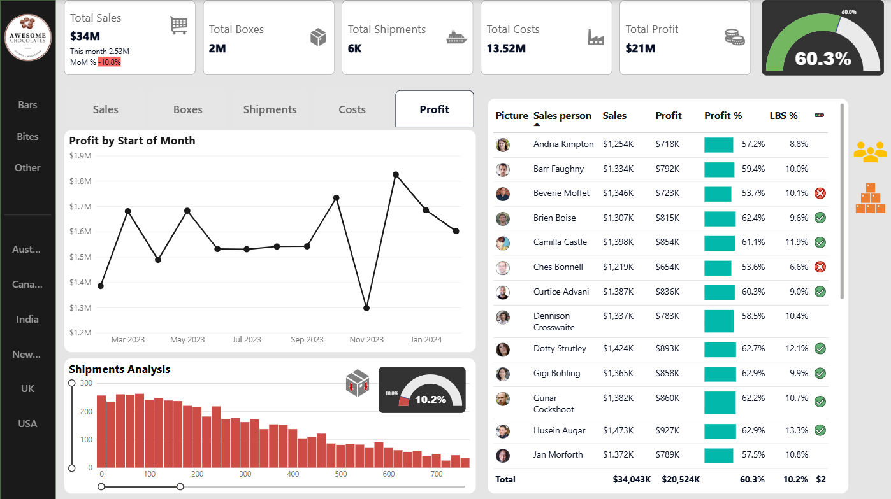

# 🍫 Awesome Chocolates Performance Dashboard

This Power BI dashboard project visualizes key performance metrics for **Awesome Chocolates**, enabling stakeholders to track sales, costs, profits, and shipment efficiency across product categories and regions.



---

## 📊 Overview

This dashboard provides a business-friendly view of:

- **Total Sales**: $34M
- **Total Boxes Sold**: 2M
- **Total Shipments**: 6K
- **Total Costs**: $13.5M
- **Total Profit**: $21M
- **Profit Margin**: 60.3%

---

## 🧠 Key Insights

- 📉 **MoM Sales dropped by 10.8%**, while shipments increased by 11.7%
- 🧑‍💼 Top performers include **Kelci Walkden**, **Curtice Advani**, and **Gigi Bohling**
- ⚖️ Shipment weight analysis shows most boxes are under 300 lbs
- 📈 November 2023 recorded the highest monthly profit
- 💡 Profit margin overall is steady and efficient at **60.3%**

---

## 📂 Repository Contents

| File Name | Description |
|-----------|-------------|
| `Sales.pbix` | Power BI dashboard source file |
| `ac-sample-data.xlsx` | Sample dataset used to create the dashboard |
| `sales_dashboard.png` | Final dashboard screenshot |
| `README.md` | Project documentation |

---

## 🛠 Tools & Skills Used

- **Power BI Desktop**  
- **Excel** (data structuring)  
- **DAX** (custom calculations, KPIs)

---

## 🧮 DAX Measures Used

```DAX
Profit % = DIVIDE([Profit], [Sales])
MoM Sales % = ([Current Month Sales] - [Previous Month Sales]) / [Previous Month Sales]
LBS % = DIVIDE([LBS Count], [Total LBS])

---
## 👤 Author

**Manthan Patel**
- Linkedin: [Manthan Patel](https://www.linkedin.com/in/manthan-patel18)
- Portfolio: [Manthan Patel](https://manthan-portfolio-opal.vercel.app/)
